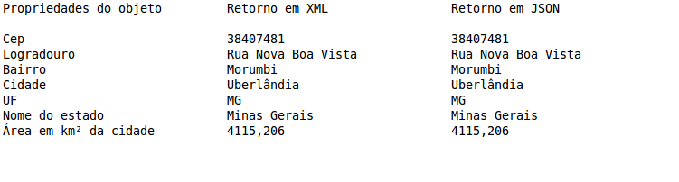

# ws-localidade-cep-java

###Objetivo

Esse projeto tem por finalidade, criar um serviço via JAVA, para que possa ser consumido em seu retorno as informações de um WebService(WS) que possui a localidade (bairro, cidade, estado, etc), dado um CEP. Esse serviço pode ser consumido em XML e JSON. Será demonstrado como manipular tais informações nos dois tipos de dados. Como mostra a imagem, acima no console do eclipse.

###Pré-requisito para rodar o projeto			 
  -JDK 7 
  -Eclipse 
  -Repositório 
 
###Tecnologias utilizadas			 
  JAVA EE, XML JSON, MAVEN, JERSEY - API WS
		 
###Como executar?
Importar o projeto no eclipse.
Botão direito do mouse no Project Explore > Import > Maven > Existing Maven Project > caminho do download feito.
Abrir a classe App.java e executar método main. ###Let's be happy :D			 

			

